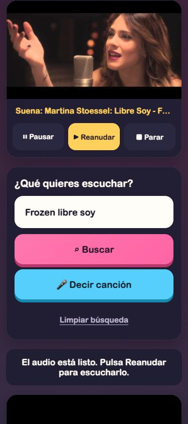

# Kids YouTube Jukebox

A small, touch-friendly home jukebox for searching YouTube songs and listening to
audio from an old mobile phone. The backend runs with FastAPI in Podman,
PostgreSQL stores search and playback history, and the phone only needs a web
browser on the same Wi-Fi network.

YouTube Data API v3 provides search results, titles, channels, and thumbnails.
`yt-dlp` resolves the selected audio stream, which the backend relays to the
browser without saving video or audio files to disk.



## Features

- Mobile-first interface with large touch targets.
- Up to ten relevant YouTube search results.
- Audio-only playback with the video thumbnail displayed as cover art.
- Pause, resume, and stop controls.
- Optional Spanish voice search through the Web Speech API.
- Persistent PostgreSQL history for searches and played songs.
- Podman-compatible container setup for macOS and Linux.
- No login or user account required on a trusted home network.

## Requirements

- Podman Desktop or Podman.
- A Google Cloud project with **YouTube Data API v3** enabled.
- A YouTube API key.
- A computer and mobile phone connected to the same Wi-Fi network.

## 1. Get a YouTube API key

1. Open the [Google Cloud Console](https://console.cloud.google.com/).
2. Create a project or select an existing one.
3. Open **APIs & Services → Library** and enable **YouTube Data API v3**.
4. Open **APIs & Services → Credentials** and select
   **Create credentials → API key**.
5. Copy the key. Google recommends restricting it; at minimum, restrict it to
   YouTube Data API v3. If you add an IP restriction, use the public IP of the
   computer or server running the application.

YouTube searches consume the Google Cloud project's daily API quota.

## 2. Configure the environment

Create your local environment file:

```sh
cp .env.example .env
```

Edit `.env` and replace the example values:

```dotenv
YOUTUBE_API_KEY=your_real_api_key
YOUTUBE_REGION_CODE=ES
YOUTUBE_RELEVANCE_LANGUAGE=es
YOUTUBE_SAFE_SEARCH=none
YOUTUBE_MUSIC_ONLY=true
APP_PORT=8000
POSTGRES_DB=jukebox
POSTGRES_USER=jukebox
POSTGRES_PASSWORD=choose_a_local_password
```

`.env` is ignored by Git and must never be committed.

## 3. Build and run with Podman

On macOS, start the Podman virtual machine first if needed:

```sh
podman machine init
podman machine start
```

The recommended setup starts the application and PostgreSQL together, waits for
the database to become healthy, and creates the required tables automatically:

```sh
podman compose up --build -d
podman compose ps
```

Open [http://localhost:8000](http://localhost:8000) on the host computer.

View logs or stop the stack with:

```sh
podman compose logs -f jukebox
podman compose down
```

The history remains in the `postgres_data` volume after `podman compose down`.
It is deleted only if you explicitly remove the volume.

### Run without PostgreSQL

The image can run on its own, but history will be disabled:

```sh
podman build -t kids-youtube-jukebox .
podman run --rm --env-file .env -p 8000:8000 kids-youtube-jukebox
```

## 4. Open the jukebox from a phone

Find the Mac's local Wi-Fi address, usually on `en0`:

```sh
ipconfig getifaddr en0
```

If that returns nothing, try `ipconfig getifaddr en1` or open
**System Settings → Wi-Fi → Details → TCP/IP**.

For example, if the address is `192.168.1.45`, open this URL on the phone:

```text
http://192.168.1.45:8000
```

Both devices must be on the same Wi-Fi. Guest networks often isolate devices
from each other.

## 5. Send the audio to an Amazon Echo

1. Say **“Alexa, pair Bluetooth.”**
2. Open Bluetooth settings on the phone.
3. Select the Echo from the available devices.
4. Open the jukebox and play a song. The phone displays the cover art while the
   audio is sent to the Echo.

Pairing can also be started in the Alexa app under
**Devices → Echo & Alexa → your Echo → Bluetooth Devices**. Exact labels may
vary between app versions.

## Search configuration

### Music-only results

By default, the application restricts results to YouTube's Music category:

```dotenv
YOUTUBE_MUSIC_ONLY=true
```

To search every video category instead, disable the filter:

```dotenv
YOUTUBE_MUSIC_ONLY=false
```

Restart the application after changing `.env`.

### Safe Search

The default value is:

```dotenv
YOUTUBE_SAFE_SEARCH=none
```

YouTube also accepts `moderate` and `strict`:

```dotenv
YOUTUBE_SAFE_SEARCH=strict
```

This setting is applied by YouTube to search requests. The application does not
implement its own parental controls.

## Persistent history

PostgreSQL stores:

- Every query, timestamp, status, result count, and search configuration.
- The returned videos, including position, ID, title, channel, and thumbnail.
- Every song that starts playing, linked to its original search.

The **Recent history** section displays the latest searches and played songs.
The same data is available through:

- `GET /api/history?limit=20`
- `POST /api/playback`
- `GET /health`

Tables are created automatically at startup. To create a local backup:

```sh
podman compose exec db pg_dump -U jukebox jukebox > jukebox-backup.sql
```

## Security

This project is designed for a trusted home network. Do not expose the current
container directly to the public Internet. It intentionally has no
authentication, so a public deployment would expose listening history and allow
other people to consume YouTube API quota and audio-proxy bandwidth.

Before an Internet-facing deployment, add HTTPS, authentication, rate limiting,
bounded concurrency and caching, signed audio URLs, strong database credentials,
and regular backups. Expose only the reverse proxy on port 443.

## Troubleshooting

### The phone cannot connect

- Confirm that `http://localhost:8000` works on the host computer.
- Check that the phone and computer use the same non-guest Wi-Fi.
- Verify the current local IP address and port.
- Allow incoming Podman connections in the macOS firewall if prompted.
- Check that the Podman machine is running with `podman machine list`.

### PostgreSQL is not ready

- Run `podman compose ps` and confirm that `db` is healthy.
- Inspect `podman compose logs db`.
- Check the `POSTGRES_DB`, `POSTGRES_USER`, and `POSTGRES_PASSWORD` values.
- If credentials are changed after the first startup, the existing volume keeps
  the old credentials. Restore the previous values or remove the volume only if
  its history is no longer needed.

### The port is not published

The run command must include `-p 8000:8000`. Check it with:

```sh
podman port kids-youtube-jukebox
```

### The application listens on `127.0.0.1`

Uvicorn must listen on `0.0.0.0` inside the container. The included
`Containerfile` already configures this.

### The API key is missing

If the UI reports `YOUTUBE_API_KEY` as missing, check that `.env` contains the
real key and that the container was started with the environment file. Recreate
the container after editing it.

### Audio does not start automatically

Mobile browsers can block automatic playback. Tap **Play** on a result and then
tap **Resume** if the browser leaves the track prepared but paused.

### A song has no available audio

`yt-dlp` resolves each track at playback time. Private, deleted, age-restricted,
or geographically blocked videos can fail. Select another result and inspect
`podman logs kids-youtube-jukebox` if every song fails.

### YouTube rejects searches

Check that YouTube Data API v3 is enabled, the API key restrictions are
compatible with the server, and the project still has quota. Inspect logs with:

```sh
podman logs kids-youtube-jukebox
```

## Local development

```sh
python3.12 -m venv .venv
source .venv/bin/activate
pip install -r requirements.txt
cp .env.example .env
set -a
source .env
set +a
uvicorn app.main:app --reload --host 0.0.0.0 --port "${APP_PORT:-8000}"
```

Run the test suite with:

```sh
python -m unittest discover -s tests -v
```

## HTTP API

- `GET /api/search?q=Frozen%20libre%20soy` returns a persisted search ID and up
  to ten objects containing `video_id`, `title`, `channel_title`, and
  `thumbnail_url`.
- `GET /api/audio/{video_id}` resolves and relays the selected audio stream with
  HTTP Range support.
- `POST /api/playback` records a successfully started track.
- `GET /api/history?limit=20` returns recent searches and playback events.
- `GET /health` reports application and database health.

## References

- [YouTube Data API `search.list`](https://developers.google.com/youtube/v3/docs/search/list)
- [Embedding yt-dlp in Python](https://github.com/yt-dlp/yt-dlp#embedding-yt-dlp)
- [Podman port publishing](https://docs.podman.io/en/latest/markdown/podman-run.1.html#publish-p-ip-hostport-containerport-protocol)
